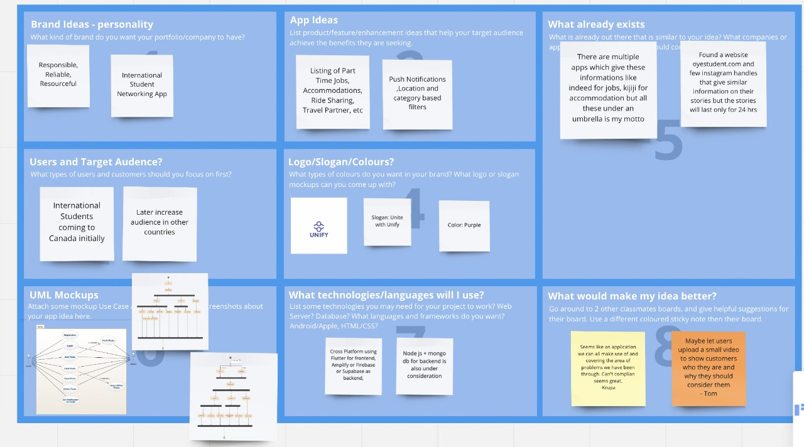
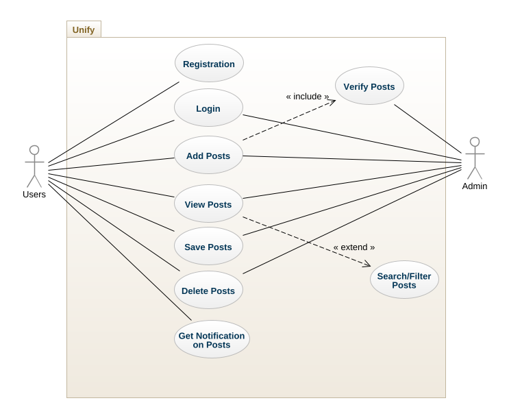
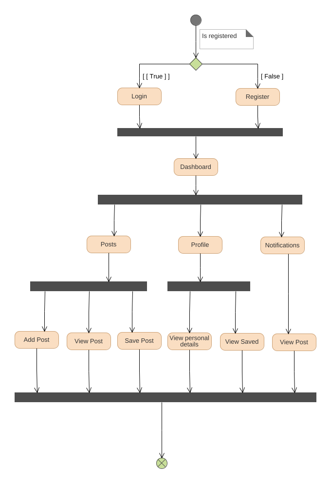
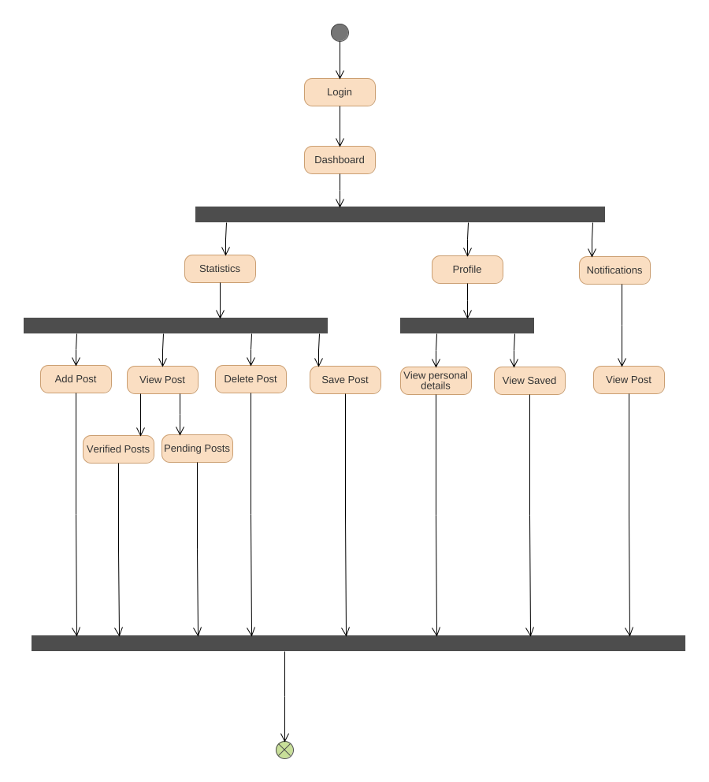

# unify-brainstorm
 Unify is a mobile application designed and developed for connecting International students in Canada. This app has the provision to add posts on jobs,accomodation,ride share, travel partners and every other student needs.

## Author : Jithin Raj
## Date : September 23rd, 2021

This is where all the planning and design for my Unify app can be found. 

## Intro
I started with going to miro and using a preset for brainstorming on a 1 - 8 page document. I used collaboration with other people to get feedback on my ideas and improve what I was working on. 

## Version Control
I am going to be using a private repository in GitHub to track all of my changes and commits while I develop this app. I am currently in the **inception** phase. You can visit my *miro* site that is running live [here](https://miro.com/app/board/o9J_lwDvtnc=/). 

## Inception Phase
I am currently in the **inception** phase. As Benjmain has quoted:
> Planning to fail is failing to plan.

## UML Diagrams

### Use Case for Unify App

## Activity Diagrams

### User Activity Diagram for Unify App

### Admin Activity Diagram for Unify App

